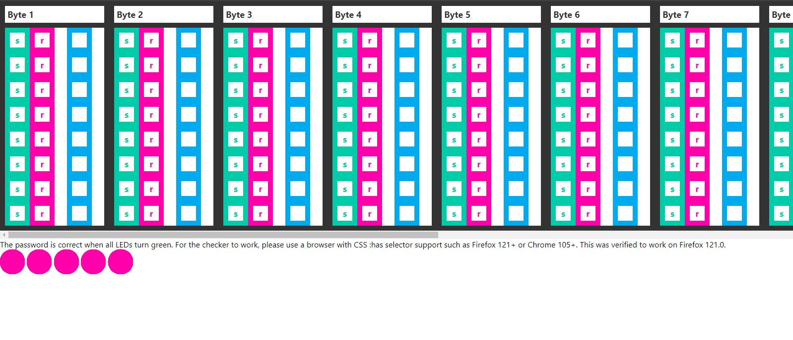
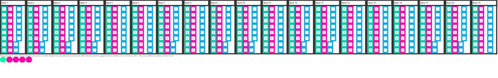

# CSS Pasword

> My web developer friend said JavaScript is insecure so he made a password vault with CSS. Can you find the password to open the vault?
Wrap the flag in uoftctf{}
Make sure to use a browser that supports the CSS :has selector, such as Firefox 121+ or Chrome 105+. The challenge is verified to work for Firefox 121.0.
Author: notnotpuns

[file](./css-password.html)

Chal description states that we need to open file in appropriate browser. Will use recent version of Chrome. It did not work in Chromium based browsers like Brave.



Examining source code we can see Internal CSS styles with comments specifiying LED, bytes and latches (bits):

```css
/* LED1 */
/* b1_7_l1_c1 */
.wrapper:has(.byte:nth-child(1) .latch:nth-child(7) .latch__reset:active) .checker:nth-of-type(2) .checker__state:nth-child(1) {
    transform: translateX(0%);
    transition: transform 0s;
}

.wrapper:has(.byte:nth-child(1) .latch:nth-child(7) .latch__set:active) .checker:nth-of-type(2) .checker__state:nth-child(1) {
    transform: translateX(-100%);
    transition: transform 0s;
}
```

where b1 - represents first Byte and 7 bit state should be set according to last state (-100%). It means we should set 7 bit to left (set) position or 1. If last style under current comment was (0%) then we set bit specified in comment to right (reset) position or 0.



Doing the same operation and manually checking every style under every comment we can build a matrix with bytes. Getting all LED green we can convert bytes to ascii and get the flag.

*uoftctf{CsS_l0g1c_is_fun_3h}*