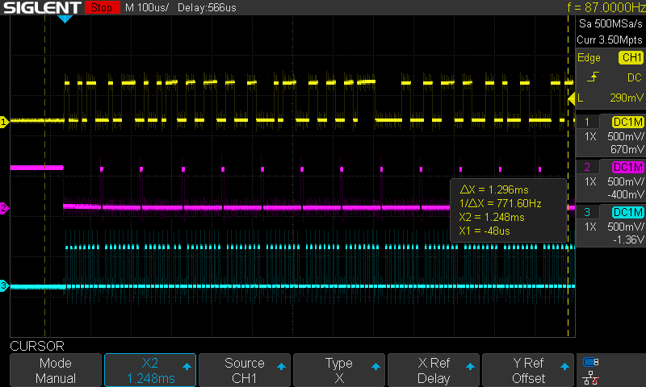
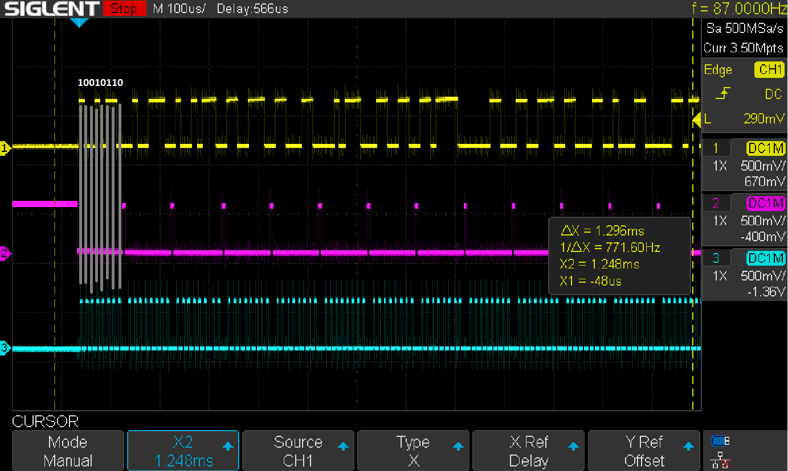
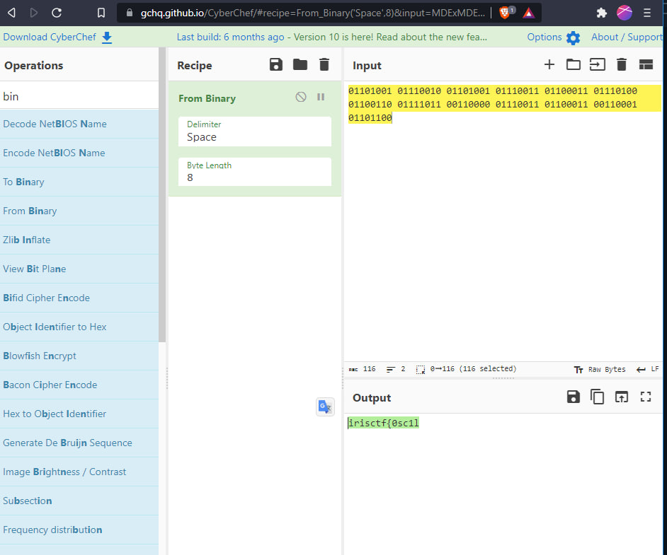

# Sir Scope

> This circuit used to write out the flag using an array of 8 LEDs, but the LEDs are all burnt out now.

As file we have several osciloscope images with signals for LED. We can see 3 traces (yellow, pink and cyan). Cyan one on the bottom seems to have exact group of 8 peaks representing 8 LED. Which can be assumed as 8 bits of ASCII. 

Lets check this hypothesis. I used dumb, but yet simple method. Drawing lines in paint from synchronization track on bottom to signal on top.

Assuming endiannes bits may be BE or LE. Checking both we find that we see LE order.

Next applying this technique I entered all group of bits to CyberChef and got first string which gives us expected result.

P.S. For sure you might think that this chal could be solved using automated methods, like openCV or PIL. I would like to see if someone will implement that method as well.

